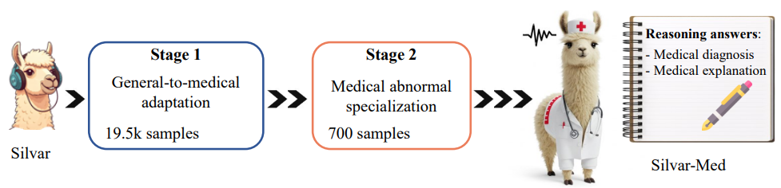

# Abstract Video Learning

<div style="text-align: center;">
  
  <p><i>Abstract Video Learning.</i></p>
</div>

---

## Installation

```bash
conda create -n AbstractVideoLearning python=3.10.13
conda activate AbstractVideoLearning
git clone https://github.com/Hanhpt23/AbstractVideoLearning.git
cd AbstractVideoLearning
pip install -r requirements.txt
```
