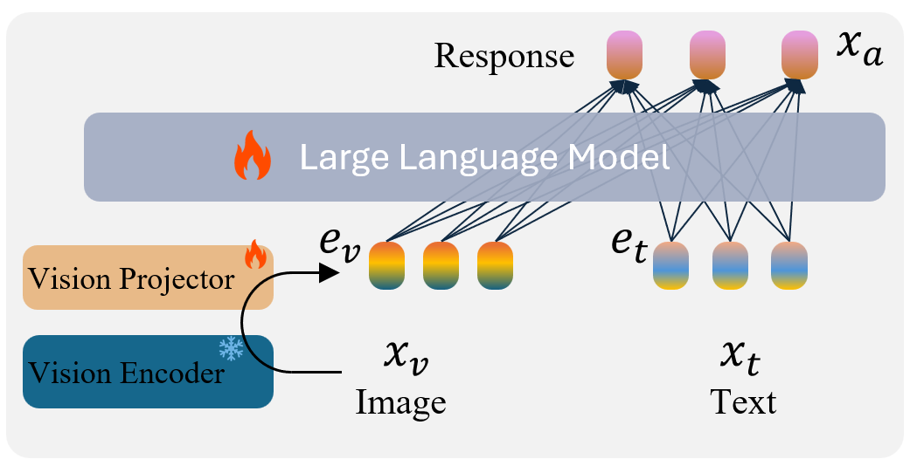
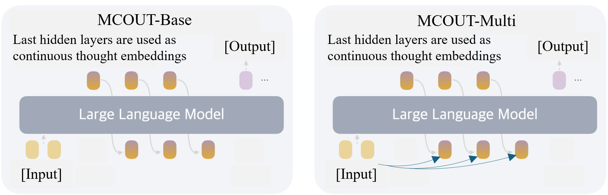

# OmniMod is the library for multimodal understanding including images, videos, and audios

## Update:
Aug. 2025 - We release the code for image understanding with multimodal chain of continuous latent reasoning


# Multimodal Chain of Continuous Thought for Latent-Space Reasoning in Vision-Language Models

[](https://arxiv.org/pdf/2508.12587) 

OmniMod is an open-source implementation of the **Multimodal Chain of Continuous Thought (MCOUT)** framework, a novel approach for enhancing reasoning in large multimodal models (LMMs). Inspired by human reflective cognition, MCOUT enables iterative reasoning in a continuous latent space, dynamically aligning visual and textual embeddings. This repository provides the code to reproduce the experiments from the associated paper, including model architecture, training pipelines, and evaluation on benchmarks like ScienceQA, MMMU, MMStar, and VQAv2.

The framework builds on a small VLM (1B parameters) using CLIP as the visual encoder and Llama 3.2 1B as the language model. It introduces two variants:
- **MCOUT-Base**: Reuses the language model's last hidden state for iterative reasoning.
- **MCOUT-Multi**: Integrates multimodal latent attention for stronger cross-modal alignment.

Key benefits include up to 8.23% accuracy gains on MMMU and improved BLEU scores, with efficient latent reasoning that reduces token overhead compared to traditional Chain-of-Thought (CoT) methods.


*Figure 1: MCOUT model architecture, combining CLIP visual encoder and Llama 3.2 1B with multimodal latent attention.*

## Overview

Many reasoning techniques for large multimodal models adapt language model approaches, such as Chain-of-Thought (CoT) prompting, which express reasoning as word sequences. While effective for text, these methods are suboptimal for multimodal contexts, struggling to align audio, visual, and textual information dynamically. To explore an alternative paradigm, we propose the Multimodal Chain of Continuous Thought (MCOUT), which enables reasoning directly in a joint latent space rather than in natural language. In MCOUT, the reasoning state is represented as a continuous hidden vector, iteratively refined and aligned with visual and textual embeddings, inspired by human reflective cognition.

We develop two variants: MCOUT-Base, which reuses the language model’s last hidden state as the continuous thought for iterative reasoning, and MCOUT-Multi, which integrates multimodal latent attention to strengthen cross-modal alignment between visual and textual features. Experiments on benchmarks including MMMU, ScienceQA, and MMStar show that MCOUT consistently improves multimodal reasoning, yielding up to 8.23% accuracy gains over strong baselines and improving BLEU scores up to 8.27% across multiple-choice and open-ended tasks.

For more details, refer to the [paper](https://arxiv.org/pdf/2508.12587).


*Figure 2: Comparison of MCOUT-Base (left) and MCOUT-Multi (right), illustrating iterative latent reasoning processes.*

## Key Features
- **Latent Reasoning in Multimodal Space**: Iterative refinement of continuous thoughts without relying on discrete token sequences.
- **Variants**: MCOUT-Base (simple hidden state reuse) and MCOUT-Multi (with multimodal latent attention).
- **Efficient Training**: Uses LoRA for parameter-efficient fine-tuning on a single GPU.
- **Benchmarks Supported**: [VQAv2](https://visualqa.org/download.html) (pretraining), [ScienceQA](https://huggingface.co/datasets/derek-thomas/ScienceQA) (fine-tuning), [MMMU](https://huggingface.co/datasets/lmms-lab/MMMU) (fine-tuning), [MMStar](https://huggingface.co/datasets/Lin-Chen/MMStar) (testing).
- **Metrics**: Accuracy and BLEU for evaluation.
- **Compatibility**: Works with small VLMs like CLIP + Llama 3.2 1B; extensible to larger models.

## Installation

To set up the environment, use a virtual environment for isolation.

```bash
# Create and activate a new conda environment
conda create -n OmniMod python=3.10.13
conda activate OmniMod

# Clone the repository
git clone https://github.com/Hanhpt23/OmniMod.git
cd OmniMod

# Install dependencies
pip install -r requirements.txt
```

### Dependencies
The `requirements.txt` includes:
- `torch>=2.0.0` (for model training and inference)
- `transformers>=4.35.0` (for Llama and Hugging Face integrations)
- `peft` (for LoRA fine-tuning)
- `datasets` (for loading benchmarks)

**Notes**:
- Ensure CUDA is installed for GPU acceleration.
- If using 8-bit precision, install `bitsandbytes`.
- Hugging Face login: Run `huggingface-cli login` to access models like Llama 3.2.

## Quick Start

After installation, test the setup with a simple inference example.

1. Download a sample model checkpoint (or train one as below).
2. Set up the evaluation configuration in `eval_configs/evaluate_image.yaml`

```bash
torchrun --nproc_per_node 1 evaluate.py \
      --cfg-path eval_configs/evaluate_image.yaml \
      --eval-dataset image_val
```
- Note: Output will be stored in a json file with the same parent path of the checkpoint, including the generated answer and and prediction.
3. Update the josn path in OmniMod/metrics/metrics.py, then run it to calculate the metrics.

```bash
python OmniMod/metrics/metrics.py
```

## Data Preparation

- Prepare datasets for training and evaluation. The annotation would be stored in a json file with 3 keys for each samples. Below is an example of the [MMMU](https://huggingface.co/datasets/lmms-lab/MMMU) data.

```json
[
  {
    "video_name": "dev_Accounting_1.png",
    "question": "Each of the following situations relates to a different company. For company B, find the missing amounts. A. $63,020 B. $58,410 C. $71,320 D. $77,490",
    "answer": "D"
  },
  ...
]
```
- Set up the path to data in file `train_configs/train_image.yaml` and `eval_configs/evaluate_image.yaml`

### Supported Datasets
- **VQAv2**: For pretraining. Download from [checkpoint VQAv2](). Extract images and annotations.
- **ScienceQA**: For fine-tuning. Download from [Baseline](), [MCOUT-Base](), [MCOUNT-Multi]().
- **MMMU**: For fine-tuning. Download from [Baseline](), [MCOUT-Base](), [MCOUNT-Multi]().
- **MMStar**: For testing. We use all pretrained weight from MMMU.


## Training

```bash
bash scripts/FuseImage/train.sh
```

**Training Notes**:
- Single GPU (A100) is sufficient due to LoRA and 8-bit precision.
- Warmup: Linear warmup cosine scheduler (initial LR 1e-6, min 1e-6, weight decay 0.05).
- For MCOUT-Base, set `use_coconut` is `True` in `train_configs/train_image.yaml` and `eval_configs/evaluate_image.yaml`. 
- For MCOUT-Multi, set `use_coconut` is `True` and `use_multimodal_coconut` is `True` in `train_configs/train_image.yaml` 
- Set `num_latent_thoughts` in the 2 for coefficient
- Auxiliary loss: Balances intermediate thoughts; ablation suggests \(\mu=0.3\) optimal. set mu > enable the auxiliary loss, or set it to 0 to disable it.

## Inference and Evaluation

Evaluate on test/validation sets using accuracy and BLEU.

### Evaluation Script

```bash
torchrun --nproc_per_node 1 evaluate.py \
      --cfg-path eval_configs/evaluate_image.yaml \
      --eval-dataset image_val
```
Output will be stored in a json file with the same parent path of the checkpoint, including the generated answer and and prediction. To see the result, pleas path the json path to `OmniMod/metrics/metrics.py`. This computes metrics and saves predictions. 

## Main Results

### ScienceQA Test Set
| Model                  | Parameters (B) | Accuracy (%) | BLEU    |
|------------------------|----------------|--------------|---------|
| **Our experiments**    |                |              |         |
| Baseline              | 1              | 56.17        | 51.48   |
| MCOUT-Base (N_t=5)    | 1              | 58.60 (↑4.33%) | 52.44 (↑1.87%) |
| MCOUT-Multi (N_t=5)   | 1              | 58.45 (↑4.05%) | **52.60 (↑2.18%)** |
| MCOUT-Base (N_t=10)   | 1              | **58.86 (↑4.79%)** | 52.31 (↑1.61%) |
| MCOUT-Multi (N_t=10)  | 1              | 58.20 (↑3.61%) | 52.27 (↑1.53%) |
| **Literature reports** |                |              |         |
| Kosmos-2 | 1.7    | 32.70        | --      |
| LLaVA-7B v1.5  | 7   | 42.50        | --      |
| InstructBLIP-7B  | 8 | 54.10   | --      |
| OpenFlamingo v2  | 9 | 44.80 | --      |
| Qwen-VL-Chat  | 9.6      | 61.50        | --      |
| MiniGPT-4-v2 | 7 | 48.20   | --      |
| LLaVA-13B v1.5  | 13   | 48.90   | --      |
| PandaGPT-13B | 13  | 63.20   | --      |
| LLaMA3-8B  | 8        | 56.50        | --      |


### MMMU Validation Set
| Model                  | Parameters (B) | Accuracy (%) | BLEU    |
|------------------------|----------------|--------------|---------|
| **Our experiments**    |                |              |         |
| Baseline              | 1              | 25.44        | 25.44   |
| MCOUT-Base (N_t=5)    | 1              | **27.53 (↑8.21%)** | **27.54 (↑8.31%)** |
| MCOUT-Multi (N_t=5)   | 1              | 27.18 (↑6.79%) | 27.19 (↑6.82%) |
| MCOUT-Base (N_t=10)   | 1              | 27.52 (↑8.18%) | **27.54 (↑8.31%)** |
| MCOUT-Multi (N_t=10)  | 1              | 27.36 (↑7.54%) | 27.37 (↑7.58%) |
| **Literature reports** |                |              |         |
| Kosmos-2  | 1.7    | 23.70        | --      |
| MiniGPT-4-v1-7B  | 7 | 23.60   | --      |
| LLaVA-7B v1.5  | 7   | 33.70        | --      |
| MiniGPT-4-v2 | 7 | 25.00   | --      |
| OpenFlamingo v2  | 9 | 28.80 | --      |
| Qwen-VL-Chat | 9.6      | 30.20        | --      |
| LLaVA-13B v1.5 | 13  | 37.00   | --      |
| PandaGPT-13B  | 13  | 32.90   | --      |
| LLaMA3-8B | 8        | 34.80        | --      |


### MMStar Test Set
| Model                  | Parameters (B) | Accuracy (%) | BLEU    |
|------------------------|----------------|--------------|---------|
| **Our experiments**    |                |              |         |
| Baseline              | 1              | 25.13        | 25.14   |
| MCOUT-Base (N_t=10)   | 1              | **26.13 (↑3.98%)** | **26.14 (↑3.98%)** |
| MCOUT-Multi (N_t=10)  | 1              | 26.07 (↑3.74%) | 26.08 (↑3.74%) |
| **Literature reports** |                |              |         |
| Kosmos-2 | 1.7    | 24.90        | --      |
| MiniGPT-4-v1-7B | 7 | 16.30   | --      |
| MiniGPT-4-v2  | 7 | 21.30   | --      |
| LLaVA-7B v1.5  | 7   | 28.20        | --      |
| OpenFlamingo v2  | 9 | 26.90 | --      |
| Qwen-VL-Chat  | 9.6      | 34.50        | --      |
| PandaGPT-13B  | 13  | 25.60   | --      |
| LLaMA3-8B  | 8        | 27.50        | --      |

## Ablation Studies

Ablation on auxiliary weight (μ) (N_t=5, MCOUT-Base):

| Auxiliary Weight (μ) | ScienceQA Acc (%) | ScienceQA BLEU | MMMU Acc (%) | MMMU BLEU |
|----------------------|-------------------|----------------|--------------|-----------|
| 0                    | 58.12 (↑3.47%)    | 52.05 (↑1.11%) | 27.41 (↑7.75%) | 27.43 (↑7.82%) |
| 0.3                  | 58.60 (↑4.33%)    | 52.44 (↑1.87%) | 27.53 (↑8.23%) | 27.54 (↑8.27%) |
| 0.5                  | 57.56 (↑2.48%)    | 52.10 (↑1.20%) | 26.44 (↑3.93%) | 26.44 (↑3.93%) |
| 0.8                  | 57.52 (↑2.40%)    | 52.00 (↑1.01%) | 25.90 (↑1.81%) | 25.91 (↑1.85%) |

Higher μ increases training time but optimal at 0.3.

## Next

We are optimizing the pipeline and extending the pipeline to support multimodal understanding including images, videos, and audios. If you are interested, please reach out to us at hanhpt.phamtan@gmail.com.


## Citation
If using this code or framework, cite the paper:

```
@article{pham2025multimodal,
  title={Multimodal Chain of Continuous Thought for Latent-Space Reasoning in Vision-Language Models},
  author={Pham, Tan-Hanh and Ngo, Chris},
  journal={arXiv preprint arXiv:2508.12587},
  year={2025}
}
```

## License
This project is for research only. 