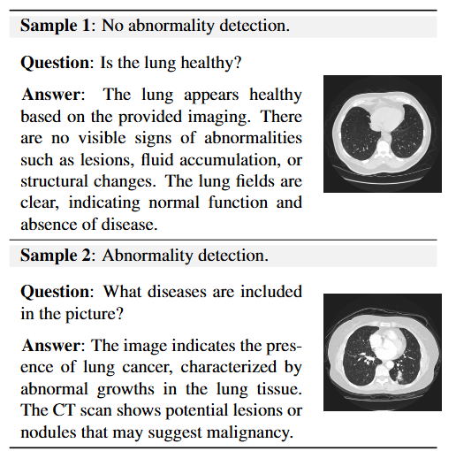
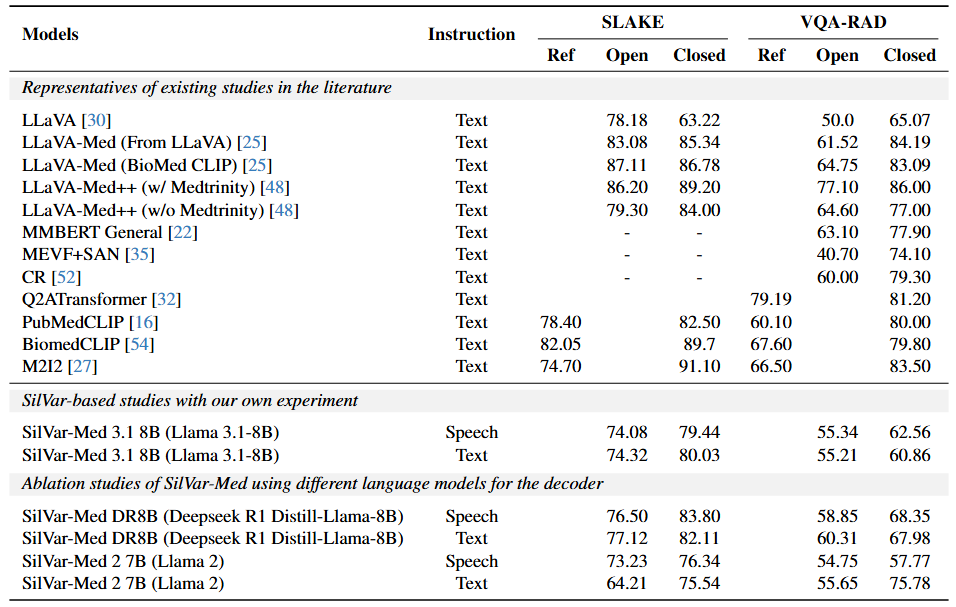
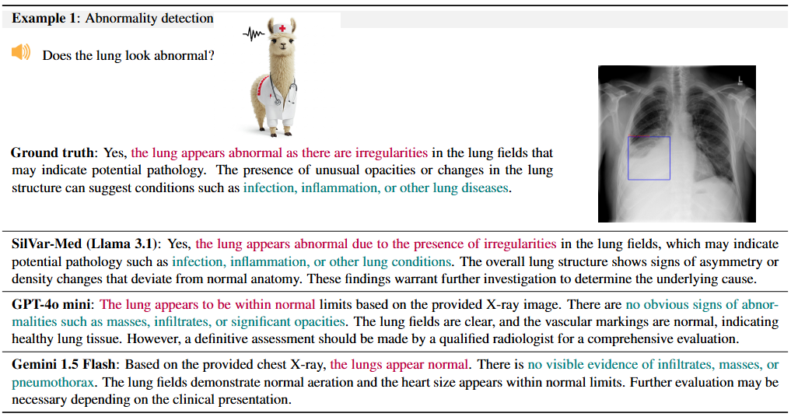

# SilVar-Med: A Speech-Driven Visual Language Model for Explainable Abnormality Detection in Medical Imaging

  
*Figure: SilVar-Med enables speech-based interaction with medical VLMs for abnormality detection and explanation.*

---

## Overview and Contribution

**SilVar-Med** introduces the first **speech-driven multimodal visual language model** tailored for medical imaging. This project pioneers **voice-based interaction** with medical VLMs, enabling clinicians to **ask questions verbally** and receive **interpretable answers** with reasoning behind each medical abnormality prediction.

We tackle two key challenges:
- Making VLMs operable via **speech** in clinical settings.
- Providing **transparent, explainable predictions** to improve trust in AI-assisted diagnosis.

Our model integrates:
- A medical vision encoder: CLIP and its variants
- A speech encoder: Whispers
- A language model: Mistral, Llama (2, 3, 3.1), Deepseek R1 (Distill Llama 8B) 
- And a reasoning-aware fusion mechanism.

---


## Installation

```bash
conda create -n SilVarMed python=3.10.13
conda activate SilVarMed
git clone https://github.com/Hanhpt23/SilVarMed.git
cd SilVarMed
pip install -r requirements.txt
```

## Training Section

**Training Configuration:**

- **Model:**
  - Vision Model: [here](train_configs/train_abnormal_OmniMedVQA_llama3.1.yaml#L7) at Line 7
  - Audio Model: [here](train_configs/train_abnormal_OmniMedVQA_llama3.1.yaml#L8) at Line 8
  - Language Model: [here](train_configs/train_abnormal_OmniMedVQA_llama3.1.yaml#L9) at Line 9
  - Others: `lora_r`, `freeze_vision`, `freeze_audio`
    - If you want to train the model end-to-end, set `freeze_vision` and `freeze_audio` to `False` [here](train_configs/train.yaml#L17) on lines 17 and 18

- **Datasets:**
  - Batch Size: [here](train_configs/train_abnormal_OmniMedVQA_llama3.1.yaml#L22) at Line 22
  - Image Path: [here](train_configs/train_abnormal_OmniMedVQA_llama3.1.yaml#L35) at Line 35
  - Annotation Path: [here](train_configs/train_abnormal_OmniMedVQA_llama3.1.yaml#L36) at Line 36
  - Audio Path: [here](train_configs/train_abnormal_OmniMedVQA_llama3.1.yaml#L37) at Line 37

- **Run:**
  - Max Epoch: [here](train_configs/train_abnormal_OmniMedVQA_llama3.1.yaml#L47) at Line 47
  - Iterations per Epoch: [here](train_configs/train_abnormal_OmniMedVQA_llama3.1.yaml#L50) at Line 50
  - Output Directory: [here](train_configs/train_abnormal_OmniMedVQA_llama3.1.yaml#L53) at Line 53
  - Weights and Biases Token: [here](train_configs/train_abnormal_OmniMedVQA_llama3.1.yaml#L67) at Line 67

**Testing Configuration:**

- **Model:**
  - Vision Model: [here](eval_configs/eval_abnormal_OmniMedVQA_llama3.1.yaml#L7) at Line 7
  - Audio Model: [here](eval_configs/eval_abnormal_OmniMedVQA_llama3.1.yaml#L8) at Line 8
  - Language Model: [here](eval_configs/eval_abnormal_OmniMedVQA_llama3.1.yaml#L9) at Line 9
  - Checkpoint: [here](eval_configs/eval_abnormal_OmniMedVQA_llama3.1.yaml#L10) at Line 10

- **Evaluation Datasets:**
  - Evaluation File Path:
  - Batch Size: [here](eval_configs/eval_abnormal_OmniMedVQA_llama3.1.yaml#L39) at Line 39
  - Image Path: [here](eval_configs/eval_abnormal_OmniMedVQA_llama3.1.yaml#L36) at Line 36
  - Audio Path: [here](eval_configs/eval_abnormal_OmniMedVQA_llama3.1.yaml#L38) at Line 38

- **Run:**
  - Save Path: [here](eval_configs/eval_abnormal_OmniMedVQA_llama3.1.yaml#L47) at Line 47


```bash
torchrun --nproc_per_node 1 train.py \
      --cfg-path train_configs/train_abnormal.yaml\
      --cfg-eval-path eval_configs/eval_abnormal.yaml\
      --eval-dataset audio_val
```


## Evaluation
```bash
torchrun --nproc_per_node 2 --master_port=29501 evaluate.py \
      --cfg-path eval_configs/eval_abnormal_one_train.yaml\
      --eval-dataset audio_val
```


## Dataset



## Experiments and Results section







## Citation

```bibtex
@article{pham2024silvar,
  title={SilVar-Med: A Speech-Driven Visual Language Model for Explainable Abnormality Detection in Medical Imaging},
  author={Tan-Hanh Pham, Chris Ngo, Trong-Duong Bui, Minh Luu Quang, Tan-Huong Pham, and Truong-Son Hy},
  journal={arXiv preprint},
  year={2025}
}
```